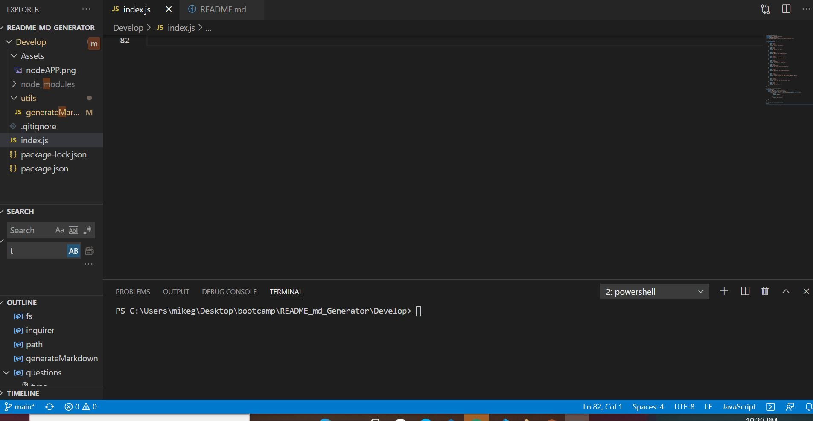
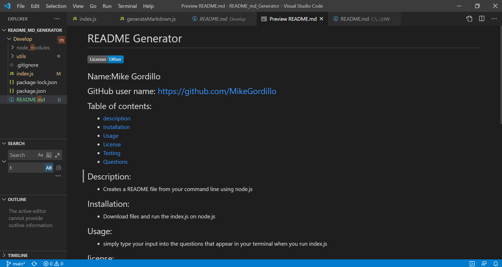

# README generator

        
## Name:Mike Gordillo
## GitHub user name: gitHub.com/MikeGordillo

## Table of contents:  
* [Description](#description)
* [Installation](#Installation)
* [Usage](#usage)
* [License](#license)
* [Testing](#testing)
* [Questions](#questions)
        
## Description:
* Creates a readme file from your command line using Node.js.
## Installation:
* Download files in this Repository and run index.js on Node.js.
## Usage:
* Simply answer all the questions you'll be prompted with, after running index.js. Once finished, a README file will be generated.
## license:
* Other
        
## Contributing:
* Yes, simply fork the repository and create a pull request for approval.
## Testing:
* npm test
## Questions:
* Contact Mike Gordillo with any questions at mikegordillotattoo@gmail.com

      